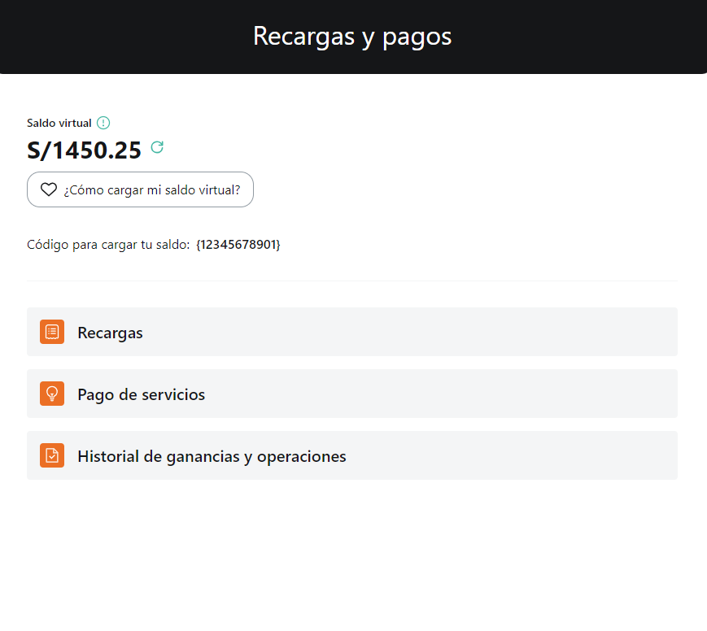
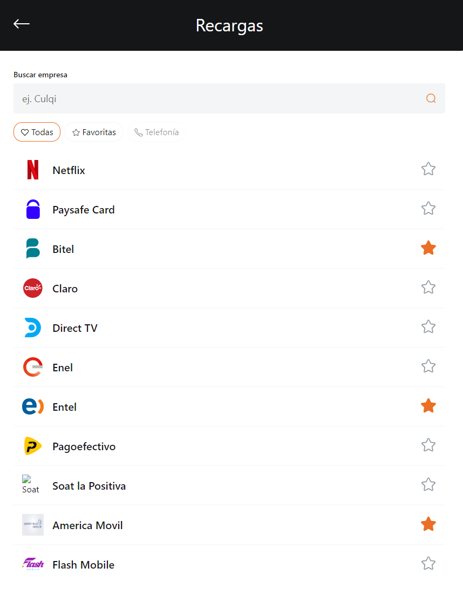
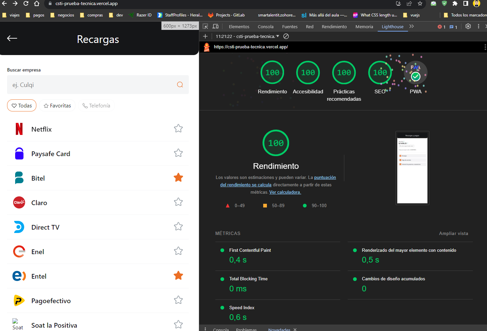

# Prueba Técnica Frontend CSTI



> Screenshot - Home page



> Screenshot - Recharges page



> Screenshot - PWA Performance

---

## Table of Contents

-   [Description](#description)
-   [How to use?](#how-to-use)
-   [References](#references)
-   [License](#license)
-   [Author](#author)

---

## Description

Certain native Android applications are being migrated to web applications with the objective of taking advantage of web capabilities and time to market of deployments productive environments versus a classic deployment of an APK or AAB. For this, the Recharge and Service Payment journey will be taken as an example. This aims to allow Culqi businesses to make recharges or PdS by earning a commission for each transaction that it makes on behalf of its clients.

### Technologies

-   Vite
-   VueJS 3
-   Express
-   Axios
-   TypeScript
-   HTML
-   CSS

[Go up](#prueba-técnica-frontend-csti)

---

## How to use?

### Installation:

Enter and run the following sentence in your console:

```html
npm install
```

### Run the project:

Enter and run the following sentence in your console:

```html
npm start
```

to enter developer mode.

Finally, open [http://localhost:3000](http://localhost:3000) to see it in your default browser.

---

## References

```html
https://aspexpressapi-production.up.railway.app/getActualBalance
```

```html
https://aspexpressapi-production.up.railway.app/getProviders
```

[Go up](#prueba-técnica-frontend-csti)

---

## Comments

-   It's been a long time since I worked with Vue and Vite and creating a PWA with SSR has been a good challenge. Great experience and learning

-   Unfortunately, I was not able to implement Vitest or Tailwind in the application. The first is due to lack of time and the second is because I prefer to use native CSS.

[Go up](#prueba-técnica-frontend-csti)

---

## License

MIT License

Copyright (c) [2021] [Heraldo Fortuna]

Permission is hereby granted, free of charge, to any person obtaining a copy
of this software and associated documentation files (the "Software"), to deal
in the Software without restriction, including without limitation the rights
to use, copy, modify, merge, publish, distribute, sublicense, and/or sell
copies of the Software, and to permit persons to whom the Software is
furnished to do so, subject to the following conditions:

The above copyright notice and this permission notice shall be included in all
copies or substantial portions of the Software.

THE SOFTWARE IS PROVIDED "AS IS", WITHOUT WARRANTY OF ANY KIND, EXPRESS OR
IMPLIED, INCLUDING BUT NOT LIMITED TO THE WARRANTIES OF MERCHANTABILITY,
FITNESS FOR A PARTICULAR PURPOSE AND NONINFRINGEMENT. IN NO EVENT SHALL THE
AUTHORS OR COPYRIGHT HOLDERS BE LIABLE FOR ANY CLAIM, DAMAGES OR OTHER
LIABILITY, WHETHER IN AN ACTION OF CONTRACT, TORT OR OTHERWISE, ARISING FROM,
OUT OF OR IN CONNECTION WITH THE SOFTWARE OR THE USE OR OTHER DEALINGS IN THE
SOFTWARE.

[Go up](#prueba-técnica-frontend-csti)

---

## Author

-   Twitter - [@heraldofortuna](https://twitter.com/heraldofortuna)
-   GitHub - [heraldofortuna](https://github.com/heraldofortuna)
-   Linkedin - [heraldofortuna](https://www.linkedin.com/in/heraldo-fortuna/)

[Go up](#prueba-técnica-frontend-csti)
